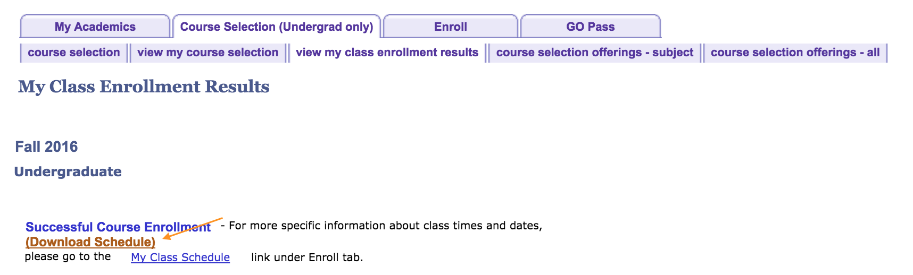

# WatCal

Allows you to export your University of Waterloo class schedule to your calendar.

Simply head over to Course Selection -> view my class enrollment results -> click on the term that you're interested to export your schedule from (e.g. Fall 2016). Please wait about 3 to 5 seconds for the `Download Schedule` link to appear under `Successful Course Enrollment` and you'll be able to download the Calendar file through that link.

You will be able to export your entire University of Waterloo class schedule, excluding Tests (as the venue is not updated yet), in one click. You can then import the generated iCalendar (.ics) file into many popular calendar applications, including Outlook, OS X Calendar, and Google Calendar. Note that your calendar's timezone should be set to **America/Toronto (UTC-05:00)** in order for the schedule to reflect the correct time.

Disclaimer: Not affiliated with or endorsed by the University of Waterloo.

Download: [Chrome Web Store](https://chrome.google.com/webstore/detail/watcal/piajnoiedgkdpnancbojkeeaddpahofd)

Forked from https://github.com/bhamodi/uwaterloo-schedule-exporter.
